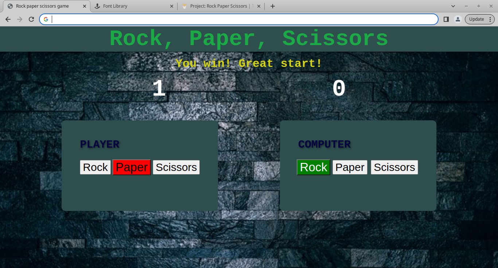

# Rock Paper Scissors Game

This is a simple implementation of the Rock Paper Scissors game using JavaScript. The game allows you to play against the computer.

## How to Play

1. Clone or download this repository.
2. Open the `index.html` file in a web browser.
3. Click your choice: Rock, Paper, or Scissors.
4. The computer will randomly select its option.
5. The round result will be displayed.
6. First to score five points is the winner.
7. The results and scores of each round are displayed.

## Demo

Try out the game live: [Rock Paper Scissors Game Demo](https://mswali-code.github.io/rock-paper-scissors-game/)

## Code Structure

The project consists of an HTML file, `index.html`, which serves as the entry point. The game logic is implemented in the JavaScript file, `script.js`. The `script.js` file contains functions to generate the computer's choice and manage the overall game flow. The styling is done using the `styles.css` file.

## Usage Examples

Here are a few examples of how the game might progress:

- You choose Rock, and the computer chooses Scissors. You win!
- You choose Paper, and the computer chooses Paper. It's a tie.
- You choose Scissors, and the computer chooses Rock. Computer wins.

Feel free to play and explore different scenarios!
